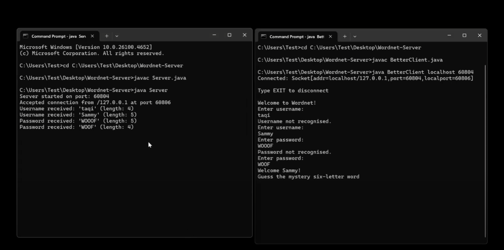

# Wordnet Server – Java Socket Game

A Java-based socket server that powers a networked game of **"Guess the Word"**, built as part of a COMP assignment. Players connect via a terminal client, authenticate, and try to guess a hidden word using hints and tracked turns.

**Watch Demo**: [YouTube Video](https://www.youtube.com/watch?v=-PH0_Q-QiKM)



## Login Credentials

- **Username:** `Sammy`
- **Password:** `WOOF`

## Game Instructions

- Mystery word: `TOPPLE`
- User inputs guesses via the client
- Server replies with correct letters and positions (e.g., `*O**LE`)
- Case-insensitive, input-validated
- Turns are counted until correct guess

## How to Run

### Server
```bash
javac Server.java
java Server
```

Take note of the port number printed (e.g., `Server started on port: 12345`)

### Client
```bash
javac BetterClient.java
java BetterClient localhost 12345
```

## 🛠 Technologies

- Java Sockets
- BufferedReader / PrintWriter
- Client-server architecture

## Features

✔️ Auth with 5 tries  
✔️ Mystery word logic  
✔️ Turn counter  
✔️ Input validation  

## File Overview

| File              | Purpose                      |
|-------------------|------------------------------|
| `Server.java`     | Main server logic + game     |
| `BetterClient.java` | Connects to server & interacts |
